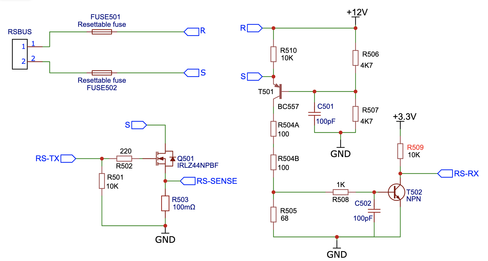

# RSbusMaster (Version 1.0) #

This Arduino library implements an RS-Bus master for the RP2040/RP2350 (Raspberry Pi Pico / Pico 2).
It generates the RS-Bus polling cycle and receives feedback messages from RS-Bus decoders,
using the RP2040/RP2350 PIO hardware for autonomous, interrupt-driven operation.

The RS-Bus is the standard feedback bus used by Lenz and several other DCC vendors.
As opposed to some other feedback systems, the RS-Bus implements a current loop (instead of
voltage levels) for signalling, making it less susceptible to noise and interference.
RS-Bus packets include a parity bit for error detection; this library extends that with
majority voting over 3 samples per bit for additional noise immunity.

For more information on the RS-Bus protocol, see:
- [der-moba website](http://www.der-moba.de/index.php/RS-Rückmeldebus) (in German)
- [https://sites.google.com/site/dcctrains/rs-bus-feed](https://sites.google.com/site/dcctrains/rs-bus-feed)

The companion library [RSbus](https://github.com/aikopras/RSbus) implements the decoder side
(feedback decoders that respond to the master).


## Hardware ##

Two GPIO pins are required:
- **txPin**: RS-Bus transmit pin. Drives the 130-pulse polling cycle.
- **rxPin**: RS-Bus receive pin. Receives feedback messages from decoders (inverted logic).

The PIO hardware handles pulse generation and reception autonomously.
Once `start()` is called, no further CPU intervention is needed per pulse.


## Operation ##

### Startup sequence ###
1. An 88ms high pulse on txPin resets all decoders on the bus.
2. A 562ms wait allows decoders to initialise and configure themselves.
3. Normal 130-pulse polling cycles begin, with a 6.85ms gap between cycles.

### Polling cycle ###
One complete polling cycle consists of 130 pulses. Each pulse addresses one RS-Bus slot.
During the low phase of each pulse (108us), the decoder at that address may respond
with an 8-bit feedback message at 4800 baud.

If no decoder responds, one cycle takes approximately 33ms
(130 × 200us pulses + 6.85ms gap).
If all 128 decoders respond, one cycle takes approximately
33 + 128 × 1.875 = 273ms.

### Majority voting ###
Each data bit is sampled 3 times, at 30%, 40% and 50% of the bit period.
Sampling is limited to the first half of the bit period because some decoders start
transmitting on the rising edge of the pulse rather than the falling edge.
The majority of the 3 samples determines the bit value.

### Error handling ###
- **Parity errors**: the gap after the affected cycle is extended to 10.7ms to signal
  the error to the decoder. The `errorsParity` counter for that address is incremented.
- **Sampling errors**: if the 3 samples for any bit are not unanimous, the
  `errorsSampling` counter for that address is incremented.


## The RsMaster class ##

### void init(uint txPin, uint rxPin, PIO pio = pio1) ###
Configures the TX and RX pins and loads the PIO programme. Must be called once before `start()`.
The optional `pio` parameter selects which PIO to use (default: `pio1`).

### void start() ###
Begins the RS-Bus startup sequence and starts the polling cycle.
Should be called after `init()`, and also after `stop()` or `abort()`.

### void stop() ###
Graceful stop: waits for the current 130-pulse cycle to complete before stopping.

### void abort() ###
Immediate stop: halts the pulse train at once. Intended for emergency situations.

### bool getRsFeedbacks(uint8_t \*message, uint8_t &length) ###
Returns up to 7 address/data pairs received since the last call.
- `message`: caller-supplied buffer of at least 14 bytes.
  Content: interleaved pairs `[addr1, data1, addr2, data2, ...]`
- `length`: number of pairs written into the buffer (0..7).
- Returns `true` if new data is available, `false` if the queue has no new entries.

### rsQueue[ ] and newestIndex ###
`rsQueue` is a circular buffer (256 entries) of all received feedback messages,
in the order they were received. `newestIndex` points to the most recently received entry.
The application may read this buffer directly by tracking the index between calls.

### fbState[ ] ###
A table with state information per RS-Bus address (index 1..128; index 0 unused).
Each entry contains:
- `nibble[2]`: last received value for nibble 0 and nibble 1
- `count`: total number of messages received for this address
- `errorsParity`: number of parity errors detected
- `errorsSampling`: number of majority voting (sampling) errors detected


## Examples ##

### BasicUsage ###
Minimal example: initialise, start, and read individual feedback messages from `rsQueue`.
Shows the address, data and nibble number for each received message.

### FeedbackMonitor ###
Uses `getRsFeedbacks()` to receive up to 7 address/data pairs per call.
Prints all received feedback in a compact format. Preferred example for further XpressNet code.

### Statistics ###
Reads the `fbState[]` table and prints per-address statistics:
message count, parity errors and sampling errors.
Useful for diagnosing RS-Bus hardware problems.

### StopAndRestart ###
Demonstrates the `stop()`, `abort()` and `start()` methods,
including correct timing of the restart sequence.


## Example sketch ##

```cpp
#include <Arduino.h>
#include <RSbusMaster.h>

const uint txPin = 14;   // GPIO pin for RS-Bus transmit
const uint rxPin = 15;   // GPIO pin for RS-Bus receive

extern RsMaster rsBus;   // Instantiated in RSbusMaster.cpp
uint8_t lastIndex;       // Tracks the last processed rsQueue entry

void setup() {
  Serial.begin(115200);
  delay(2000);
  lastIndex = rsBus.newestIndex;
  rsBus.init(txPin, rxPin);
  rsBus.start();
}

void loop() {
  while (lastIndex != rsBus.newestIndex) {
    lastIndex++;
    uint8_t addr = rsBus.rsQueue[lastIndex].address;
    uint8_t data = rsBus.rsQueue[lastIndex].data;
    uint8_t nb   = (data >> 4) & 0x01;
    uint8_t bits = data & 0x0F;
    Serial.print(addr);
    Serial.print(", ");
    for (int i = 3; i >= 0; i--) Serial.print((bits >> i) & 1);
    Serial.print(" ("); Serial.print(nb); Serial.println(")");
  }
}
```

## Support pages ##
- [Basic operation](extras/BasicOperation.md) — RS-Bus protocol, timing, majority voting, parity and error handling
- [PIO assembly code](extras/pio.md) — detailed explanation of the PIO programme that drives pulse generation and feedback reception

## Release notes ##

### V1.0 (2026-05-27) ###
- Initial release
- RP2040 and RP2350 supported
- PIO-based pulse generation and feedback reception
- Majority voting (3 samples per bit)
- Parity error detection with extended gap signalling
- Per-address state table (`fbState[]`) with error counters
- `getRsFeedbacks()` for batched reception of up to 7 pairs per call


## Schematics and PCBs ##
The software has been tested on a Pico 2 board, using the following RSBus master schematics (see also: Der-Moba).
[](extras/Schematics.png)
A PCB for a complete master station will soon be available from the EasyEda homepage:
[https://easyeda.com/aikopras](https://easyeda.com/aikopras)


## References ##
- Der-Moba (in German): http://www.der-moba.de/index.php/RS-Rückmeldebus
- https://sites.google.com/site/dcctrains/rs-bus-feed
- RSbus decoder library: https://github.com/aikopras/RSbus
